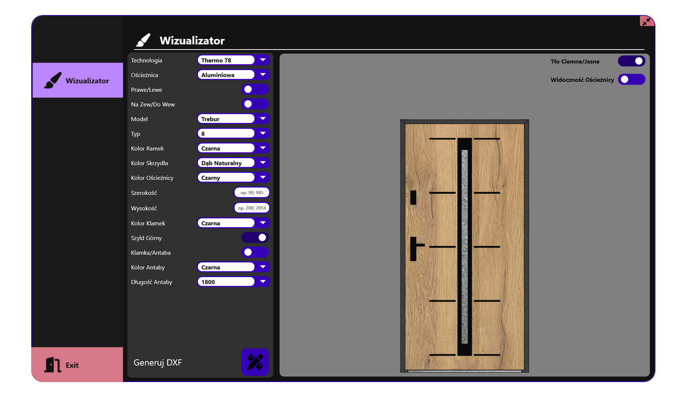
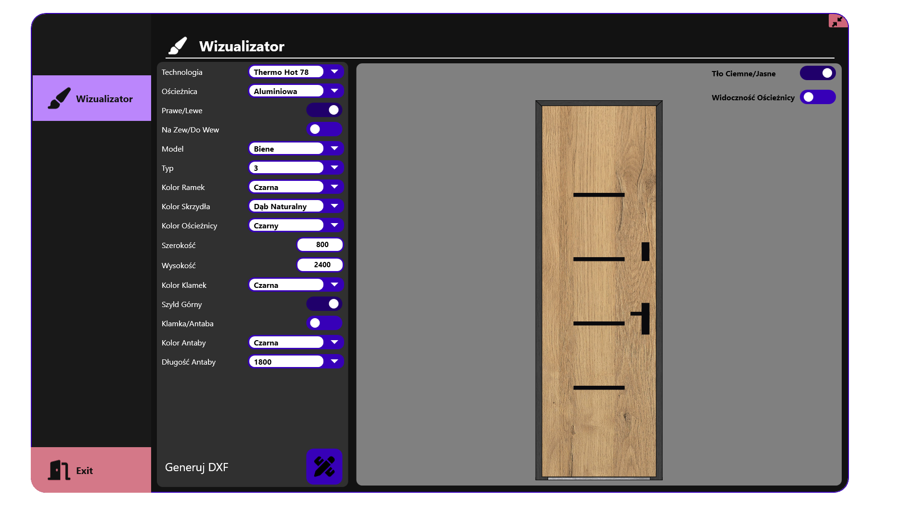
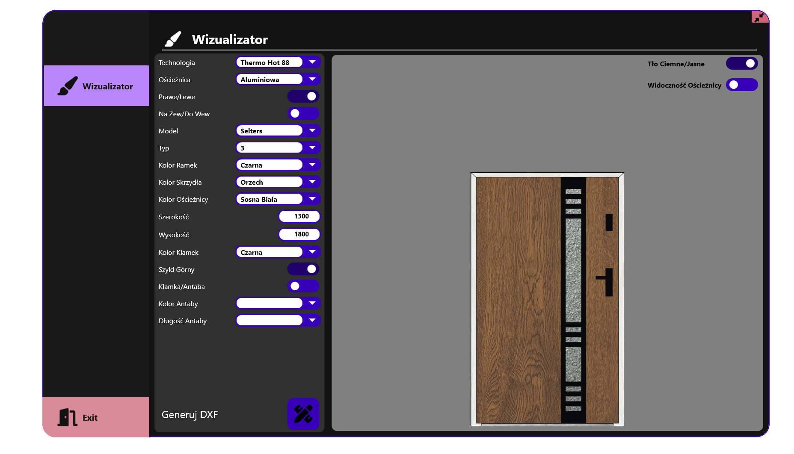

# Wizualizer
 
### Dynamiczny podgl¹d drzwi w zale¿noœci od wybranych parametrów.

## Technologie
* .NET 7.0
* WPF
* FontAwesome.Sharp
* IxMilia.Dxf

## Opis
Program generuje dynamicznie obraz na podstawie wybranych parametrów. 
Pod przyciskiem 'Generuj DXF' tworzony jest plik dxf z wstawkami ozdobnymi wystêpuj¹cymi na drzwiach.
Dodatkowo ten przycisk zapisauje widok drzwi do pliku.

